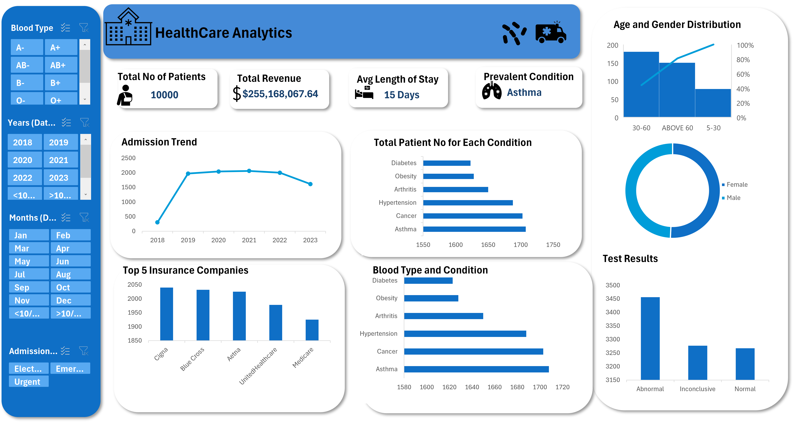

## ABOUT ME
Hello! I'm Adelakun Bukunmi, a passionate data analyst and a medical doctor with a unique blend of clinical expertise and analytical skills. Alongside my medical practise, I developed a strong interest in data analysis. While my medical background has sharpened my problem solving abilities and attention to detail, my passion for data extends beyond healthcare, encompassing diverse industries and data types.

## SKILLS
**✔Data Cleaning and transformtion.**
I perform data cleaning, preprocessing, and transformation tasks to ensure data accuracy, consistency , and readiness for analysis.I handle missing values, outliers and data type conversions while restructuring datasets for optimal analytical performance.

**✔Data Analysis.**
I apply stastical analysis, hypothesis testing, or modeling using SQL, Microsoft Excel and Power BI to identify trends, patterns, correlations and key findings.

**Data Visualization**
I present results of my aanalysis using clear charts, dashboards and reports. I also highlight key metrics, KPIs, and actionable insights.

**Interpretation and Recommendation**
I translate my findings into clear, real world implications, provide suggestions and recommendations based on my analysis.

## MY PROJECTS
**✔CAR SALES ANALYSIS**
I carried out analysis on car pricing based on fuel type, gear typr and car condition over a particular period.

**✔HEALTH CARE ANALYSIS**
I generated actionable insights to highlight the prevalent medical conditions,insurance coverage disparities, admission trends over the years and was able to find out  blood types assosciated with certain medical conditions.

,
